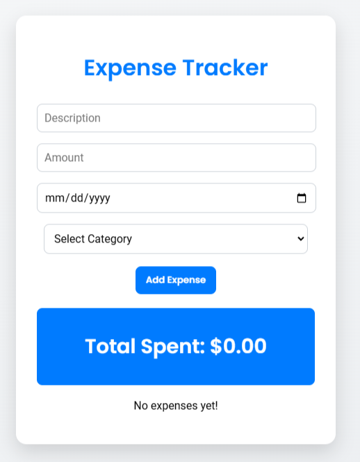

# 💰 Expense Tracker

A modern, feature-rich Expense Tracker application built with **React**. This app allows users to easily manage their expenses, categorize them, and keep track of spending trends.

## 🛠 Features

- **Add Expenses**: Add expenses with a description, amount, date, and category.
- **Expense Categories**: Categorize expenses for better organization (e.g., Food, Transportation, Entertainment).
- **View Expense List**: Displays all expenses with relevant details.
- **Delete Expenses**: Remove expenses you no longer want to track.
- **Expense Summary**: View the total amount spent at a glance.
- **Persistent Data**: All data is saved locally using `localStorage`.

## 📸 Screenshots



## 🔧 Installation & Setup

Follow these steps to set up the project locally:

1. Clone the repository:
   ```bash
   git clone https://github.com/1oridevs/expense-tracker.git
   cd expense-tracker
   ```
2. Install dependencies:
   ```bash
   npm install 
   ```
3. Start the server
   ```bash
   npm start
   ```

## 🛠 Built With
 - **React**: JavaScript library for building the user interface.
 - **localStorage**: To persist data locally in the browser.
 - **CSS**: For styling the app.

## 🤝 Contributions
Contributions are welcome! Feel free to fork the repository and submit pull requests. For major changes, please open an issue to discuss what you would like to change.

## 📧 Contact
 - **GitHub**: @1oridevs
 - **Email**: oridevs.official@gmail.com